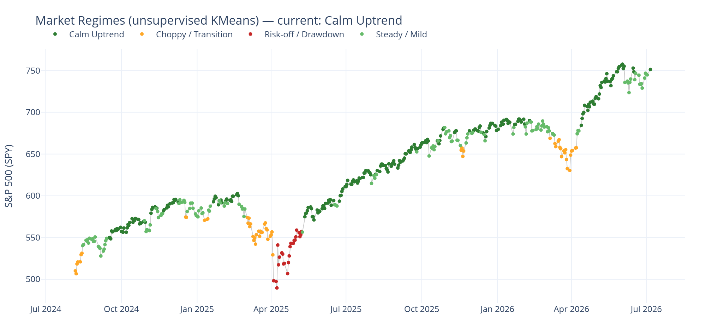
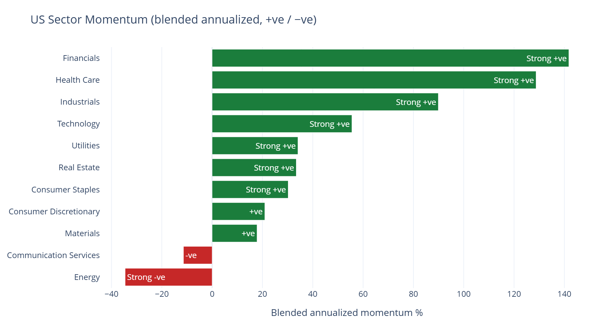
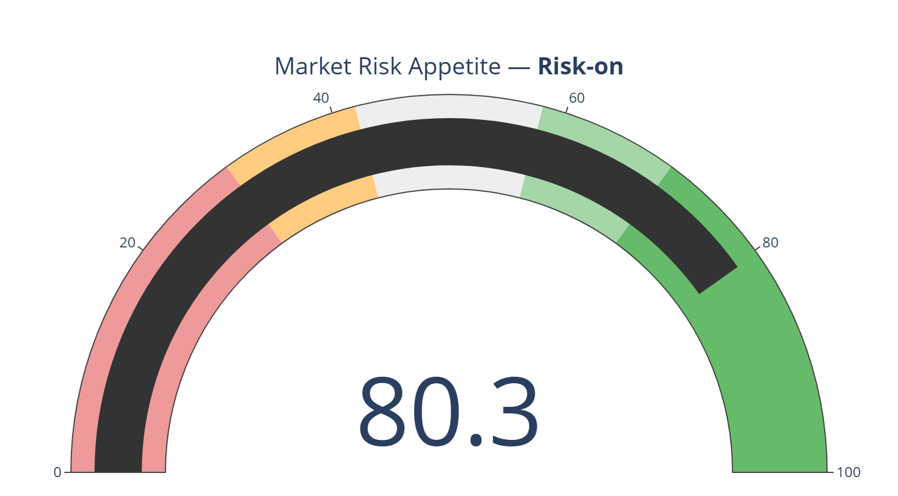

# 📊 Market & Sector Analysis Dashboard

A top-down, **end-of-day** dashboard that reads the market from the top: overall
**sentiment**, **sector momentum** (positive/negative), **technicals**, and
**constituent-based fundamentals** across US sectors and global markets — built
with Python, Streamlit, and free Yahoo Finance data.
> **Live demo:** _https://market-sector-analysis-dashboard.onrender.com_ .


> **Descriptive analysis, not investment advice.** This project summarizes market
> *state* — it does **not** predict prices, generate buy/sell signals, or
> recommend any security. It's a portfolio/learning project. Data is end-of-day
> and may be delayed.

---

## Preview

**Market regime detection (unsupervised ML)** — KMeans labels each trading day's
regime from trend, volatility, VIX, breadth, and drawdown. The clusters line up
with real market structure (drawdowns in red, chop in orange, uptrends in green):



**Sector momentum** — blended, recent-weighted annualized momentum per sector,
classified +ve / −ve, ranked strongest to weakest:



**Market sentiment** — a composite risk-appetite gauge (trend, VIX, breadth, rotation):



---

## Why this exists

Most "stock dashboard" projects jump straight to price predictions. This one
deliberately stays at the **analysis** layer that actually informs a top-down
view: *Is the market risk-on or risk-off? Which sectors have positive vs negative
momentum? How do sectors stack up on trend, RSI, and valuation?* Those are
answerable, defensible questions — no crystal ball required.

## Features

- **🧭 Market Overview** — a composite **risk-appetite gauge (0–100)** with a
  Risk-off → Risk-on label, built from four EOD signals: S&P 500 trend, VIX
  percentile, sector breadth, and the cyclical-vs-defensive rotation spread. Plus
  a previous-close summary of the broad indices (SPY / QQQ / IWM / DIA).
- **🧠 Market Regime (ML)** — an **unsupervised KMeans** model clusters the daily
  market state (trend, volatility, VIX, breadth, drawdown) into *k* data-driven
  regimes, auto-labeled by their stress profile (Calm Uptrend → Risk-off /
  Drawdown). Shows today's regime, days-in-regime, a per-regime profile table, and
  a colored regime timeline over the S&P 500. Descriptive, not predictive.
- **🔄 Sector Momentum** — the centerpiece: a recent-weighted, annualized
  momentum score per SPDR sector, classified **Strong +ve → Strong −ve**, ranked,
  with relative strength vs the S&P 500. Shown as a signed heatmap-style bar chart
  plus a sortable table.
- **🌍 Global & Regional** — the same momentum lens across country/region ETFs
  (EM, Europe, China, Japan, Brazil, India, Korea, UK).
- **💰 Fundamentals** — **constituent-based** sector valuation: median P/E (ttm &
  fwd), P/B, net margin, and dividend yield across each sector's representative
  large-cap holdings.
- **🔎 Detail** — any instrument: candlestick with SMA 20/50/200, RSI, and MACD,
  plus a technical snapshot (trend posture, RSI regime, distance from the 200-day).

## How it works (methodology)

| Piece | How it's computed |
|---|---|
| **Momentum score** | Recent-weighted blend of *annualized* trailing returns: `0.5·ann(1m) + 0.3·ann(3m) + 0.2·ann(6m)`. Sign is meaningful; label thresholds gate on the score **and** trend posture. |
| **Relative strength** | Sector 3-month return minus the S&P 500's 3-month return. |
| **Sentiment (0–100)** | Mean of four sub-scores in [0,1]: trend (SPY vs 50/200-day MA), volatility (1 − VIX 1-year percentile), breadth (% sectors > 50-day MA), rotation (cyclical − defensive 3-month spread, squashed). |
| **Technicals** | RSI(14), MACD(12/26/9), SMA 20/50/200, 52-week range, all causal and descriptive. |
| **Fundamentals** | yfinance `.info` per representative holding → median per sector. Cached per day. |
| **Market regime** | KMeans on standardized daily features (21d return, 21d realized vol, VIX, breadth, drawdown); clusters ordered by a stress score and given readable labels. Unsupervised — no target, no forecast. |

The rule-based pieces are transparent by design; the one ML layer (regime
clustering) is **unsupervised and descriptive** — it labels the market
environment learned from data, not a price forecast or trade signal.

## Tech stack

Python · [Streamlit](https://streamlit.io) · [yfinance](https://github.com/ranaroussi/yfinance)
· pandas · NumPy · [scikit-learn](https://scikit-learn.org) · [Plotly](https://plotly.com/python/)

## Setup

```bash
git clone https://github.com/<your-username>/market-sector-analysis-dashboard.git
cd market-sector-analysis-dashboard
python -m venv .venv
# Windows: .\.venv\Scripts\Activate.ps1   |   macOS/Linux: source .venv/bin/activate
pip install -r requirements.txt
```

## Run

```bash
streamlit run app.py
```

Opens at <http://localhost:8501>. The first load fetches EOD prices (and one quote
per fundamentals holding) from Yahoo and caches them to `data/` for the day; use
**Refresh data** in the sidebar to force a re-pull.

Prefer a quick check without the UI? `python smoke_test.py`.

## Project structure

```
app.py                 Streamlit dashboard (6 tabs)
analysis/
  universe.py          ETF universe (sectors / broad / global) + constituents
  data.py              yfinance EOD fetch + per-day parquet cache
  technicals.py        RSI / MACD / SMAs / multi-timeframe returns + trend posture
  sectors.py           blended momentum score + relative strength + classification
  sentiment.py         composite risk-appetite gauge (trend/VIX/breadth/rotation)
  regime.py            unsupervised KMeans market-regime detection (the ML layer)
  fundamentals.py      constituent-based sector valuation (cached)
smoke_test.py          end-to-end check, no server
requirements.txt
```

## Limitations

- **End-of-day only**, and dependent on free Yahoo Finance data (occasional gaps
  or delisted tickers are skipped gracefully).
- Fundamentals use a **handful of representative holdings** per sector, not full
  holdings — a reasonable proxy, not the exact ETF aggregate. `.info` fields can
  be sparse; missing values show as blanks.
- Momentum and sentiment labels are **descriptions of past/current state**, not
  forecasts.

## Disclaimer

For educational and research purposes only. Nothing here is investment advice, a
recommendation, or a solicitation to buy or sell any security. Do your own
research and consult a licensed professional.

## License

[MIT](LICENSE) — replace `Snehal Biju` in the license file with your name.
